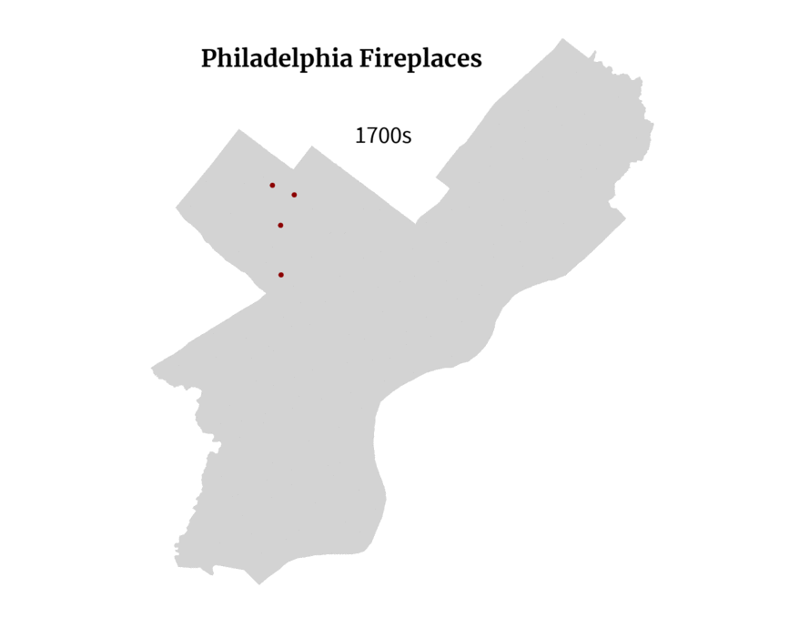

```{r setup, include=FALSE}
knitr::opts_chunk$set(echo = FALSE)
```

I'm a big fan of Sharon Jones' holiday album, and when I was listening last month, one song in particular got me thinking. After listening to ["No Chimneys in the Projects,"](https://www.npr.org/templates/story/story.php?storyId=121804437) I remembered that I had seen a column in the City's [property assessment data](https://www.opendataphilly.org/dataset/opa-property-assessments) listing the number of fireplaces in buildings. I think of fireplaces as a luxury, especially somewhere in Philadelphia where few houses use wood as their primary source of heat. Given Philly's abundance of historic buildings that might be more likely to have fireplaces than newer housing (or so I guessed) and this single column in the property assessment data, I thought I'd do a little digging.

I downloaded the data from OpenDataPhilly and then did a little filtering; I removed any building that wasn't single family housing, as the vast majority of recorded fireplaces are in single family homes [(and single family housing makes up the majority of Philly's residential buildings)](https://tylerjtran.github.io/data_blog/posts/2021-01-24-what-does-housing-look-like-in-different-philly-neighborhoods/). I know for a fact that the dataset isn't 100% accurate (I've been fortunate to live in an apartment with a fireplace, but it wasn't recorded in the data).

From a quick glance at the map below where the black dots symbolize fireplaces and pink areas represent the lowest-income census tracts in Philly, it's clear that there isn't much overlap. Most of the fireplaces appear to be concentrated in Northwest Philly and neighborhoods surrounding Center City. The pink parts of the map are based on median household income, which maybe isn't the best metric for this. For example, University City is included in the pink area, where a lack of income for many students likely brings the median downward. Maybe next Christmas I'll regenerate this with a more appropriate metric of poverty.

```{r, fig.retina=1, message=F, warning=F, echo=F, results = 'hide', fig.width=7, fig.height=9}
library(tidyverse); library(sf); library(tidycensus); library(lubridate); library(showtext); library(patchwork)


#######################################################################

# Set up fonts

font_add_google('Merriweather')
font_add_google('Source Sans Pro', 'ssp')
font_add_google('Lora', 'old_serif')
font_add_google('Courier Prime', 'old_mono')

showtext_auto()

font_theme <- theme(
  plot.title = element_text(family = 'Merriweather', face = 'bold'),
  plot.subtitle = element_text(family = 'ssp'),
  axis.text = element_text(family = 'ssp'),
  axis.title = element_text(family = 'ssp'),
  plot.caption = element_text(family = 'ssp', color = 'darkgray')
)

#######################################################################

# Get census tracts and Azavea neighborhoods from opendataphilly
tracts <- st_read('http://data.phl.opendata.arcgis.com/datasets/8bc0786524a4486bb3cf0f9862ad0fbf_0.geojson')
neighborhoods <- st_read('https://raw.githubusercontent.com/azavea/geo-data/master/Neighborhoods_Philadelphia/Neighborhoods_Philadelphia.geojson')
city <- st_read('http://data.phl.opendata.arcgis.com/datasets/063f5f85ef17468ebfebc1d2498b7daf_0.geojson') %>%
  st_union()
rivers <- st_read('https://opendata.arcgis.com/datasets/2b10034796f34c81a0eb44c676d86729_0.geojson') %>%
  filter(MUNI == 'Philadelphia',
         CREEK_NAME %in% c('Wissahickon Creek', 'Pennypack Creek', 'Cobbs Creek',
                           'Schuylkill River', 'Delaware River'))

# Run the race_ethnicity code to get get_race_ethnicity() function
source('../../../philly_analyses/race_ethnicity/race_ethnicity.R')

load('../../../philly_analyses/fireplaces/all_sfh.Rdata')
# Commenting this part out because my computer is slow and I can load faster with the RData loaded above
# # All single family homes with some year and value bounds
# all_sfh <- st_read('https://phl.carto.com/api/v2/sql?filename=opa_properties_public&format=geojson&skipfields=cartodb_id&q=SELECT+*+FROM+opa_properties_public') %>%
#   filter(category_code_description == 'Single Family') %>%
#   mutate(has_fireplace = fireplaces > 0,
#          year_built = as.numeric(year_built)) %>%
#   filter(year_built >= 1600,
#          year_built <= year(today()),
#          market_value <= 4000000)


# get median household income data from ACS and split into quantiles
med_income <- get_acs(geography = 'tract',
                      variables = 'B19013_001',
                      state = 'PA',
                      county = 'Philadelphia',
                      year = 2019,
                      geometry = T) %>%
  mutate(income_quantile = cut_number(estimate, 5),
         income_quantile = factor(income_quantile, levels = levels(income_quantile), ordered = TRUE),
         lowest_income = income_quantile == min(income_quantile, na.rm = T))

map_theme <- theme(
  panel.background = element_blank(),
  panel.grid = element_blank(),
  axis.text = element_blank(),
  axis.title = element_blank(),
  axis.ticks = element_blank())

# Map of fireplaces overlaid on lowest-income census tracts
ggplot() +
  geom_sf(data = city, fill = 'lightgray', col = NA) +
  geom_sf(data = med_income %>%
            filter(lowest_income),
          fill = '#b36f93', col = '#b36f93') +
  geom_sf(data = rivers, fill = 'darkgray', col = 'darkgray') +
  geom_sf(data = all_sfh %>%
            filter(has_fireplace),
          shape = '.', size = 2) +
  labs(title = "There are relatively few fireplaces in Philadelphia's poorest neighborhoods",
       subtitle = 'Red areas show the lowest-income census tracts in Philly, and black dots show all recorded fireplaces') +
  font_theme +
  map_theme

```

In a city as racially segregated as Philadelphia (just like many other cities in the US), there's a lot of overlap between areas experiencing severe poverty and areas with a higher proportion of Black and brown residents. The side-by-side maps below show fireplaces on the left with a map of race and ethnicity on the right. This map was inspired by [The Racial Dot Map](https://demographics.virginia.edu/DotMap/) created by Dustin Cable at the University of Virginia. While the UVA map shows a dot for each person recorded by the US Census, the map below shows one dot for every 10 people recorded by the American Community Survey. It generally appears that the areas with the highest concentration of fireplaces are also areas with higher concentration of white residents. One potential exception is in the area around Mount Airy, which appears to be a little less segregated than many other neighborhoods, and which seems to have a lot of fireplaces. More on that later! 


```{r, layout='l-body-outset', fig.retina=1, out.width='100%', message=F, warning=F, echo=F, results = 'hide', fig.width=9, fig.height=7}
# race breakdowns of census block groups
race_bg <- get_race_ethnicity(geography = 'block group', geometry = T) %>%
  filter(! is.na(race_eth))

# # Generate dot map a la UVA map
# race_points <- NULL
# for (i in 1:nrow(race_bg)){
#   race_points <- rbind(
#     race_points,
#     st_sample(race_bg[i,], round(race_bg$n[i]/10)) %>%
#       st_sf() %>%
#       mutate(race_eth = race_bg$race_eth[i])
#   )
# }

# # Generate dot map like above
# This method seems to be slower than the for loop
# race_points <- map(unique(race_bg$race_eth), function(group) {
#   race_bg %>%
#     filter(race_eth == group) %>%
#     st_sample(., size = .$n) %>%
#     st_sf() %>%
#     mutate(group = group) 
# }) %>%
#   reduce(rbind) %>%
#   group_by(group) %>%
#   summarise()

# Load race_points shapefile (this can be made with the code directly above, but it takes awhile to run)
race_points <- st_read('../../../philly_analyses/race_ethnicity/race_points.shp') %>%
  mutate(race_eth = if_else(race_eth %in% c('Native American', 'Native Hawaiian or Pacific Islander',
                                            'Two or more races', 'Other'),
                            'Other',
                            as.character(race_eth)))

# Use colors that are similar to UVA's map
my_cols <- c('#ff0202', '#aad44b', '#edb12c', '#e2c46e', '#86bbe3')

legend_text <- tibble(
  labels = c('Asian', 'Black', 'Latinx', 'Other', 'White'),
  lat = c(39.96, 39.94, 39.92, 39.9, 39.88),
  lng = rep(-75.09, 5)
) %>%
  st_as_sf(coords = c('lng', 'lat'), crs = st_crs(city))


# side-by-side map: left, fireplaces as points 0.5, dark red. right, racial dot map
left_map <- ggplot() +
  geom_sf(data = city, fill = 'lightgray', col = NA) +
  geom_sf(data = all_sfh %>% filter(has_fireplace), size = 0.01, col = 'black') +
  labs(title = 'Fireplaces') +
  font_theme +
  map_theme +
  theme(plot.title = element_text(hjust = 0.5))

right_map <- ggplot() +
  geom_sf(data = city, fill = NA, col = NA) +
  geom_sf(data = race_points, aes(col = race_eth), shape = '.') +
  geom_sf_text(data = legend_text, aes(label = labels, color = labels), face = 'italic') +
  scale_color_manual(values = my_cols) +
  labs(title = 'Race and Ethnicity of Residents',
       subtitle = 'Each point represents 10 people', 
       col = 'Race/Ethnicity') +
  font_theme + 
  map_theme +
  theme(plot.title = element_text(hjust = 0.5),
        plot.subtitle = element_text(hjust = 0.5),
        legend.position = 'none')

left_map + right_map 
```


The next step in my line of thinking was to look at the assessed market value of these homes with fireplaces compared to houses without fireplaces. Obviously there are tons of factors that could influence a property value assessment like size, neighborhood, age, amenities, and [race of homeowners](https://www.nytimes.com/2020/08/25/realestate/blacks-minorities-appraisals-discrimination.html). I'm not going to get too deep into controlling for different factors that affect real estate, but I wanted to look at age of homes versus assessed market value in the context of fireplace prevalence. An abundance of appraisal appeals and an audit commissioned by the City have found that [the Office of Property Assessment's appraisal model is flawed](https://www.inquirer.com/news/assessment-audit-opa-city-council-philadelphia-property-taxes-20190103.html). Additionally, many of the "year built" values are estimates. Given that market value and estimated construction year are two columns already in the dataset I was working with, that's what I used, flaws and all.

In the graph below, each dot is a home in Philadelphia. Homes with fireplaces are colored red, and those without are colored gray. Unsurprisingly, there aren't that many newer homes with lower assessed values and even fewer new homes with fireplaces with lower assessments. 

```{r, layout='l-body-outset', fig.retina=1, out.width='100%', message=F, warning=F, echo=F, results = 'hide', fig.width=8.11, fig.height=4.6, preview = T}
# Function to calculate % of houses with fireplaces
calc_p_fireplace <- function(df, col_of_interest){
  df %>%
    as_tibble() %>%
    select(-geometry) %>%
    group_by({{ col_of_interest }}, has_fireplace) %>%
    count() %>%
    ungroup() %>%
    complete({{ col_of_interest }}, has_fireplace = c(T, F), fill = list(n = 0)) %>%
    filter(! is.na(has_fireplace)) %>%
    group_by({{ col_of_interest }}) %>%
    summarise(n_sfh = sum(n),
              n_fireplace = n[has_fireplace],
              p_fireplace = n_fireplace/n_sfh)
}


# Age vs market value plot
ggplot() +
  geom_point(data = all_sfh %>%
               filter(! has_fireplace),
             aes(x = year_built, y = market_value), col = 'darkgray', alpha = 0.5) +
  # Plot as a separate object to make sure these are on top
  geom_point(data = all_sfh %>%
               filter(has_fireplace),
             aes(x = year_built, y = market_value), col = 'darkred', alpha = 0.3) +
  labs(title = 'Inexpensive new houses with fireplaces are rare in Philadelphia',
       x = 'Construction Year', y = 'Assessed Market Value',
       subtitle = str_wrap('Each point on the graph below is a house; red points are houses with fireplaces and gray points are houses without fireplaces.')) +
  annotate('text', x = 2032, y = 130000, label = 'This house sold\nfor $425k but is\nassessed at $15k', 
           family = 'ssp') +
  geom_curve(aes(x = 2023, y = 130000, xend = 2017.8, yend = 24000),
             arrow = arrow(type = 'closed', length = unit(0.1, 'in'))) +
  expand_limits(x = 0, y = 0) +
  scale_y_continuous(expand = c(0, 0),
                     breaks = c(0, 200000, 400000, 600000), 
                     labels = c('$0', '$200k', '$400k', '$600k'),
                     limits = c(0, 600000)) +
  scale_x_continuous(limits = c(1921, 2045), expand = c(0, 0),
                     breaks = c(1925, 1950, 1975, 2000)) +
  theme(panel.background = element_blank(),
        panel.grid = element_blank(),
        axis.title.x = element_text(hjust = 0.38)) +
  font_theme

```

Thinking about fireplaces with a temporal aspect made me wonder if the historic nature of Philadelphia might show up in trends in fireplaces that currently exist. My initial line of thinking was that maybe there'd be more fireplaces in Old City (or some other neighborhood with older buildings) given that using a fireplaces as a primary source of heat was more common historically than currently. But is there a temporal aspect that goes along with any spatial patterns? For example, do a higher proportion of houses built in the 19th Century have fireplaces than those built in the 20th Century? It's difficult to make any conclusions like that, because houses might have been demolished or replaced, and this dataset reflects properties as they currently exist...but that didn't completely cure my curiosity.

I stumbled across a super interesting master's thesis by Mathew Grubel titled ["Central Changes in Domestic Heating: Lingering Traditions and New Technology in Philadelphia, 1690-1890"](https://repository.upenn.edu/cgi/viewcontent.cgi?article=1394&context=hp_theses). The thesis is obviously more thouroughly-researched and thoughtful than a blogpost by a non-expert (me), and it inspired me to look into the "year built" variable in the dataset a little more. The animation below shows houses with fireplaces based on their estimated decade of construction. There are a few decades where it seems like fireplaces were more in fashion, but for the most part, these are decades with higher overall construction, and not just construction of houses with fireplaces.


```{r}
# gif: Temporal aspect of fireplaces that currently exist


```

On all the fireplace maps I made, Northwest Philly stood out to me because it has so many fireplaces compared to other parts of the city. Mathew Grubel's thesis gave me a few ideas why that might be. Grubel talks about German influence in architecture in Philadelphia (and across Pennsylvania). "German closed stoves" became a common type of fireplace in Philadelphia, especially in the northwest around Germantown and Chestnut Hill where many German and Dutch families lived from the 17th Century onward.

Though this dataset only includes houses that currently exist and not an inventory of all the houses throughout history, we can still look at fireplace prevlance across space and time in a way by using the year of construction. The heatmap below shows a few neighborhoods I selected and the proportion of single family homes built in that decade that have a fireplace. The proportions range from 0% of homes to 62% of homes (Chestnut Hill in the early 20th Century). If a square is dark gray, that means there are no single family homes currently recorded as having been built in a particular decade. The prevalence of dark gray boxes in many of the neighborhoods towards the bottom of the heatmap really speaks to the disinvestment in those neighborhoods in the 1980s and 1990s (and today). Unsurprisingly, those neighborhoods have higher proportions of Black residents and deeper poverty than many of the neighborhoods higher on the heatmap. 

```{r, fig.retina=1, message=F, warning=F, echo=F, results = 'hide', fig.width=7, fig.height=10}
# Get citywide % of homes w fireplaces by decade (to bind below)
citywide <- all_sfh %>%
  filter(year_built >= 1900,
         year_built <= 2019) %>%
  mutate(decade = year_built - (year_built %% 10),
         period = paste0(decade, 's')) %>%
  calc_p_fireplace(col_of_interest = period) %>%
  mutate(mapname = 'Citywide', .after = 'period') %>%
  group_by(mapname) %>%
  mutate(neigh_avg = mean(p_fireplace, na.rm = T))

# selected neighborhoods for heatmap below
selected_neighborhoods <- c('Upper Roxborough', 'Society Hill', 'Chestnut Hill', 'West Mount Airy',
                            'Passyunk Square', 'Northern Liberties', 'Queen Village',
                            'Pennsport', 'Roxborough', 'Fishtown - Lower Kensington',
                            'Graduate Hospital', 'Fairmount', 'Rittenhouse', 'Point Breeze', 'Brewerytown',
                            'Grays Ferry', 'Strawberry Mansion')

# for a selection of neighborhoods, what % of houses built each decade have fireplaces?
neighborhood_heatmap <- neighborhoods %>%
  st_join(all_sfh, join = st_intersects) %>%
  filter(year_built >= 1900,
         year_built <= 2019) %>%
  mutate(decade = year_built - (year_built %% 10),
         period = paste0(decade, 's')) %>%
  as_tibble() %>%
  select(-geometry) %>%
  group_by(period, mapname, has_fireplace) %>%
  count() %>%
  ungroup() %>%
  complete(period, mapname, has_fireplace = c(T, F), fill = list(n = 0)) %>%
  filter(! is.na(has_fireplace)) %>%
  group_by(period, mapname) %>%
  summarise(n_sfh = sum(n),
            n_fireplace = n[has_fireplace],
            p_fireplace = n_fireplace/n_sfh) %>%
  filter(mapname %in% selected_neighborhoods) %>%
  mutate(mapname = if_else(mapname == 'Fishtown - Lower Kensington',
                           'Fishtown',
                           as.character(mapname))) %>%
  group_by(mapname) %>%
  # Get an average % by neighborhood across time to arrange the heatmap by
  mutate(neigh_avg = mean(p_fireplace, na.rm = T)) %>%
  ungroup() %>%
  bind_rows(citywide)


bold_citywide <- c(rep('plain', 6), 'bold.italic', rep('plain', 11))

# Create a heatmap of % of homes with fireplaces by construction decade
neighborhood_heatmap %>%
  ggplot(aes(x = period, y = reorder(mapname, neigh_avg), fill = p_fireplace)) +
  geom_tile(col = 'white') +
  scale_fill_gradient(low = '#ededed', high = 'darkred') +
  # coord_equal() +
  scale_x_discrete(position = 'top') +
  scale_y_discrete(position = 'right') +
  labs(title = 'A comparison of neighborhood fireplaces over time',
       x = '', y = '',
       subtitle = str_wrap('The heatmap below shows the prominence of fireplaces in different neighborhoods of Philadelphia visualized by decade of home construction. Darker-red squares signify that a higher proportion of homes built during that decade have fireplaces. A gray square means that there are currently no homes recorded that were built during that decade.')) +
  theme(
    panel.background = element_blank(),
    panel.grid = element_blank(),
    axis.ticks = element_blank(),
    axis.title = element_blank(),
    legend.position = 'none',
    plot.title = element_text(size = 14),
    axis.text.y = element_text(face = bold_citywide)
  ) +
  font_theme

```


```{r, layout='l-body-outset', fig.retina=1, out.width='100%', message=F, warning=F, echo=F, results = 'hide', fig.width=8.11, fig.height=4.6}

# Look at prevalence of fireplaces in 1800s to compare to Penn master's thesis
# fireplaces_1800s <- all_sfh %>%
#   filter(year_built >= 1800,
#          year_built < 1900) %>%
#   mutate(decade = paste0(as.character(year_built - (year_built %% 10)), 's')) %>%
#   calc_p_fireplace(col_of_interest = decade)
# 
# fireplaces_1800s %>%
#   ggplot() +
#   labs(x = 'Decade', y = 'Fraction of Homes with Fireplaces',
#        title = 'Prevalence of Fireplace by Construction Decade') +
#   geom_bar(aes(x = decade, y = p_fireplace), stat = 'identity', fill = 'black', color = 'black') +
#   scale_y_continuous(expand = c(0, 0), labels = scales::percent) +
#   theme(panel.background = element_rect(fill = '#fdfae7'),
#         plot.background = element_rect(fill = '#fdfae7'),
#         panel.border = element_rect(color = 'black', fill = NA),
#         panel.grid = element_line(linetype = 'dashed', color = 'black'),
#         plot.title = element_text(family = 'old_mono'),
#         axis.title = element_text(family = 'old_serif'),
#         axis.text = element_text(family = 'old_serif'))

```


In a nod to Grubel's thesis on the history of domestic heating in Philadelphia, I re-created one of his graphs using somewhat similar current-day data. The top graph below is a plot from his 1998 thesis showing the primary form of heating for homes by decade. My graph underneath it isn't an exact update: rather than longitudinal data, the decades on my graph represent the decade of a house's construction, and the houses included are only those that currently exist in 2021. 


```{r, out.width='90%'}

# knitr::include_graphics('heating_by_decade.png')
```


```{r, fig.retina=1, message=F, warning=F, echo=F, results = 'hide', fig.width=6.5, fig.height=4.75}
heat_1800s <- all_sfh %>%
  as_tibble() %>%
  select(-geometry) %>%
  filter(year_built >= 1800,
         year_built < 1900) %>%
  mutate(decade = paste0(as.character(year_built - (year_built %% 10)), 's'),
  fuel_type = case_when(
    fuel == 'A' ~ 'Natural gas',
    fuel == 'B' ~ 'Oil',
    fuel == 'C' ~ 'Electric',
    fuel == 'D' ~ 'Coal',
    fuel == 'E' ~ 'Solar',
    fuel == 'F' ~ 'Wood',
    fuel == 'G' ~ 'Other',
    fuel == 'H' ~ 'None',
    TRUE ~ NA_character_
  ),
  heater_type = case_when(
    type_heater == 'A' ~ 'Hot air',
    type_heater == 'B' ~ 'Hot water',
    type_heater == 'C' ~ 'Electric baseboard',
    type_heater == 'D' ~ 'Heat pump',
    type_heater == 'E' ~ 'Other',
    type_heater == 'G' ~ 'Radiant',
    TRUE ~ NA_character_
  )) %>%
  filter(! is.na(decade),
         ! is.na(heater_type)) %>%
  group_by(decade) %>%
  count(heater_type) %>%
  mutate(p = n/sum(n))


# 6.5w x 4.75tall
heat_1800s %>%
  filter(heater_type %in% c('Hot water', 'Hot air', 'Electric baseboard')) %>%
  mutate(heater_type = factor(heater_type, levels = c('Hot water', 'Hot air', 'Electric baseboard'))) %>%
  ggplot() +
  labs(x = 'Decade', y = 'Fraction of Homes',
       title = 'Primary Form of Heating By Decade Built',
       caption = 'Includes single family homes existing in 2021.') +
  geom_bar(aes(x = decade, y = p, fill = heater_type),
           stat = 'identity', position = 'dodge', color = 'black') +
  scale_y_continuous(expand = c(0, 0), labels = scales::percent) +
  scale_fill_manual(values = c('#4a4a4a', 'black', '#fdfae7')) +
  guides(fill = guide_legend(nrow = 1)) +
  theme(panel.background = element_rect(fill = '#fdfae7'),
        plot.background = element_rect(fill = '#fdfae7'),
        panel.border = element_rect(color = 'black', fill = NA),
        panel.grid = element_line(linetype = 'dashed', color = 'black'),
        plot.title = element_text(family = 'old_mono'),
        axis.title = element_text(family = 'old_serif'),
        plot.caption = element_text(family = 'old_serif'),
        axis.text = element_text(family = 'old_serif'),
        legend.position = c(0.6, 0.938),
        legend.title = element_blank(),
        legend.background = element_blank(),
        legend.text = element_text(family = 'old_serif'),
        legend.box.background = element_rect(fill = '#fdfae7', color = 'black'))
```

I hope you enjoyed this journey into Philadelphia's fireplaces through the lens of open data! If you get nothing else out of this post, I hope that you'll [listen to some Sharon Jones](https://www.npr.org/templates/story/story.php?storyId=121804437) (rest in peace), as she's the one who got my wheels turning originally.


