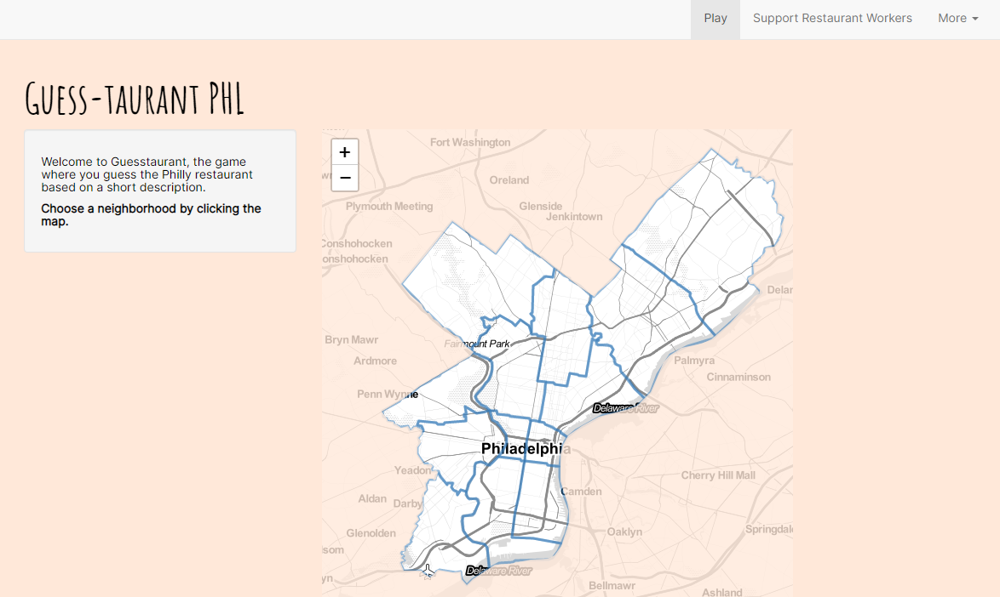

```{r setup, include=FALSE}
knitr::opts_chunk$set(echo = FALSE)
```

```{r}


```

One of the things I've been missing a lot during the pandemic is eating in restaurants. Sometimes I find myself panning through Google Maps just reminding myself of all the great spots around me. Luckily, many of them do takeout, but it's not quite the same.

I've created a Shiny app in R to make a little game out of the restaurant hunt! A friend from New York visited me in Philly a couple years ago, and she was looking at Google Maps for places to have dinner. She started reading some of the restaurant descriptions on the map, and we made a game out if it. She'd read a description, and I'd try to guess the restaurant. It's a lot of descriptions like "hole in the wall," "no-frills spot," etc. 

During a year when many people haven't been eating at restaurants and many restaurant workers have been struggling, I made Guesstaurant PHL because I think it's fun and to provide a way for people to donate to restaurant workers if they're able.

Try it out at [guesstaurantphl.com](guesstaurantphl.com), and let me know what you think!

