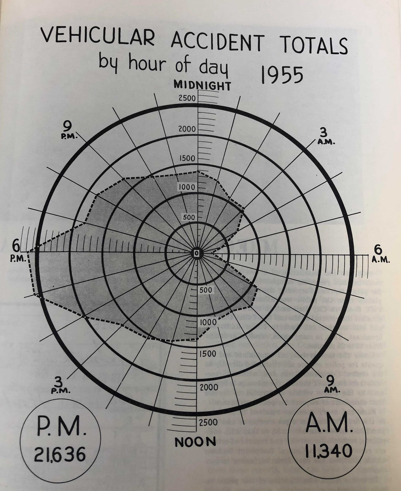

```{r setup, include=FALSE, message=FALSE, warning=FALSE}
knitr::opts_chunk$set(echo = FALSE)
```


A few months ago, I visited the [City Archives](https://www.phila.gov/departments/department-of-records/city-archives/) (which I highly recommend!) and came across a lot of interesting data visualization in old government annual reports. Much of it was hand-drawn, and I was impressed by the precision.

I found the graph below in the Philadelphia Police Department's 1955 annual report. The graph shows car crash totals in 1955 by time of day. While I'm not normally a huge fan of radar plots (or spider plots), I liked this example. The roundness of the chart, depicting hours of the day, reminded me of a clock; I might have created two separate plots (one for AM and one for PM) so that the numbers on the graph align with clock numbers, but I'll stick to a closer replication for now. 

```{r, out.width='70%', fig.align='center'}

```


The 1955 graph shows a total of almost 33,000 car crashes that year, with peaks around 5PM and 6PM). That year, 6AM saw the fewest crashes. I downloaded more recent data from [PennDOT's crash data portal](https://crashinfo.penndot.gov/PCIT/welcome.html?TYPE=33554433&REALMOID=06-6e7f3fd5-ee48-4b22-8067-774762688650&GUID=&SMAUTHREASON=0&METHOD=GET&SMAGENTNAME=qfDlIxJMXfJ9uPJ2rznv9yavuYmFziqJ43YH2ERRPvbiJL6F2MEFaMBpNPUtJnN4&TARGET=-SM-https%3a%2f%2fcrashinfo%2epenndot%2egov%2f) and re-created the graph using 2019 pre-pandemic crash data.


```{r, layout='l-body-outset', fig.width=6, fig.height=6, out.width='70%', fig.retina=1.2, fig.align = 'center', message=F, warning=F, echo=F, results = 'hide', preview = T}

library(tidyverse); library(ggradar); library(showtext); library(patchwork)

#########################################################################
# Set up fonts

font_add_google('Patrick Hand')

showtext_auto()

crash_19 <- read_csv('../../../philly_analyses/crashes/CRASH_PHILADELPHIA_2019.csv')

# Number of crashes involving vehicles, bikes, and pedestrians per hour
# Some crashes might involve multiple modes
crash_by_hour_19 <- crash_19 %>%
  group_by(HOUR_OF_DAY) %>%
  summarise(n_total = n(),
            n_w_vehicle = sum(AUTOMOBILE_COUNT > 0),
            n_w_bicycle = sum(BICYCLE_COUNT > 0),
            n_w_pedestrian = sum(PED_COUNT > 0)) %>%
  filter(HOUR_OF_DAY != '99')

# Get a wide version for ggradar()
crash_by_hour_19_wide <- crash_by_hour_19 %>%
  # transpose
  pivot_longer(-HOUR_OF_DAY, names_to = 'mode', values_to = 'n') %>%
  pivot_wider(id_cols = mode, names_from = HOUR_OF_DAY, values_from = n)

am_hours <- c('00', '01', '02', '03', '04', '05',
              '06', '07', '08', '09', '10', '11')

n_am <- crash_by_hour_19 %>%
  filter(HOUR_OF_DAY %in% am_hours) %>%
  summarise(n = sum(n_w_vehicle))

n_pm <- crash_by_hour_19 %>%
  filter(! HOUR_OF_DAY %in% am_hours) %>%
  summarise(n = sum(n_w_vehicle))

ggradar(crash_by_hour_19_wide %>%
          filter(mode == 'n_w_vehicle'), 
        font.radar = 'Patrick Hand',
        grid.max = 550,
        grid.min = 0,
        axis.labels = c('MIDNIGHT', '', '', '3AM', '', '', '6AM',
                        '', '', '9AM', '', '', 'NOON', '', '', '3PM',
                        '', '', '6PM', '', '', '9PM', '', ''),
        centre.y = 0,
        values.radar = c(0, 225, 550),
        label.centre.y = T,
        gridline.label.offset = 0,
        label.gridline.mid = F,
        label.gridline.min = F,
        grid.label.size = 4,
        background.circle.colour = 'white',
        gridline.mid.colour = "gray",
        gridline.min.linetype = "solid",
        gridline.mid.linetype = "solid",
        gridline.max.linetype = "solid",
        label.gridline.max = T,
        group.point.size = 0) +
  labs(title = 'VEHICULAR CRASH TOTALS',
       subtitle = 'by hour of day 2019') +
  annotate('text', x = -675, y = -575, family = 'Patrick Hand',
           label = paste0('P.M.\n', scales::comma(n_pm$n)), size = 8) +
  annotate('text', x = 675, y = -575, family = 'Patrick Hand',
           label = paste0('A.M.\n', scales::comma(n_am$n)), size = 8) +
  annotate('point', x = -675, y = -575, size = 32, pch = 1, stroke = 1.5) +
  annotate('point', x = 675, y = -575, size = 32, pch = 1, stroke = 1.5) +
  theme(plot.title = element_text(hjust = 0.5, family = 'Patrick Hand'),
        plot.subtitle = element_text(hjust = 0.5, family = 'Patrick Hand'))
```

I noticed that the 2019 graph had a pretty similar shape as the 1955 graph, except it was slightly rotated. In 2019, the peak is around 4PM, and the lowest point is around 4 or 5AM, each about an hour before the peak and valley from 1955. That could be because of daylight saving (maybe?) which didn't exist in 1955, or maybe commuting patterns and rush hours were different, or maybe I have a timezone issue that I didn't address in the data!

One thing I noticed was that the magnitude of car crashes in 2019 (8,200 crashes) is much lower than in 1955 (about 33,000 crashes). This is even more interesting given that car ownership rates have [almost tripled](https://www.energy.gov/eere/vehicles/fact-841-october-6-2014-vehicles-thousand-people-us-vs-other-world-regions) in the US since the 50s (one caveat is that Philly's population was higher in the 50s than it is now). I can't remember if there was any context included with the visualization in the 1955 annual report, but it's possible that the 1955 version is more inclusive of incidents other than crashes; the title of the 1955 graph was "Vehicular Accident Totals" instead of "Crash" totals, so who knows. Another potential reason for the discrepancy is that car crash data is [notoriously under-reported](https://www.bloomberg.com/news/articles/2021-07-15/how-many-traffic-crashes-are-going-unreported), especially if the drivers hit pedestrians or bicyclists; maybe that trend of under-reporting has changed over time. Or, it's possible that people are actually crashing less now than they were in the 50s!

The graph above uses 2019 crash data to avoid the effects of the COVID-19 pandemic, when people (at first) were driving much less than usual. In the early stages of the pandemic, many office workers stopped commuting to their offices. My thinking was that with less driving, there'd be fewer crashes. To take a look at whether that was actually true, I re-created the graph and distinguished between "pre-pandemic crashes" (nine months from June 2019 to February 2020) shown in yellow below and "pandemic crashes" (nine months from April to 2020) shown in red below. 

Though I didn't dig any deeper than just making this visualization (and these nine-month periods could be complicated by seasonality), there doesn't seem to be much difference between pre-pandemic and pandemic crash magnitudes. However, it does seem that the peak/valley rush hour pre-pandemic pattern isn't as prominent during the pandemic, which would make sense if fewer people are driving at rush hour.


```{r, layout='l-body-outset', fig.width=6, fig.height=6, out.width='70%', fig.retina=1.2, fig.align='center',message=F, warning=F, echo=F, results = 'hide'}

crash_pandemic <- read_csv('../../../philly_analyses/crashes/CRASH_PHILADELPHIA_2020.csv') %>%
  # mutate(period = 'Pandemic') %>%
  filter(CRASH_MONTH != '03') %>%
  mutate(period = case_when(
    CRASH_MONTH %in% c('01', '02') ~ 'Pre-pandemic',
    TRUE ~ 'Pandemic'
  )) %>%
  # rm this col bc they're different types and i'm not using it
  select(-CONS_ZONE_SPD_LIM) %>%
  bind_rows(crash_19 %>%
              filter(CRASH_MONTH %in% c('06', '07', '08', '09', '10', '11', '12')) %>%
              mutate(period = 'Pre-pandemic')) %>%
  filter(AUTOMOBILE_COUNT > 0)

crash_by_hour_pandemic <- crash_pandemic %>%
  count(HOUR_OF_DAY, period) %>%
  filter(HOUR_OF_DAY != '99')

# Get a wide version for ggradar()
crash_by_hour_pandemic_wide <- crash_by_hour_pandemic %>%
  pivot_wider(id_cols = period, names_from = HOUR_OF_DAY, values_from = n)


ggradar(crash_by_hour_pandemic_wide, 
        font.radar = 'Patrick Hand',
        grid.max = 450,
        grid.min = 0,
        axis.labels = c('MIDNIGHT', '', '', '3AM', '', '', '6AM',
                        '', '', '9AM', '', '', 'NOON', '', '', '3PM',
                        '', '', '6PM', '', '', '9PM', '', ''),
        centre.y = 0,
        values.radar = c(0, 225, 550),
        label.centre.y = T,
        gridline.label.offset = 0,
        label.gridline.mid = F,
        label.gridline.min = F,
        grid.label.size = 4,
        background.circle.colour = 'white',
        gridline.mid.colour = "gray",
        gridline.min.linetype = "solid",
        gridline.mid.linetype = "solid",
        gridline.max.linetype = "solid",
        label.gridline.max = T,
        group.point.size = 0) +
  labs(title = 'VEHICULAR CRASH TOTALS',
       subtitle = 'pandemic vs pre-pandemic') +
  annotate('text', x = 50, y = 250, family = 'Patrick Hand',
           label = 'Pandemic', size = 4, hjust = 0, col = '#FF5A5F') +
  annotate('text', x = 130, y = 180, family = 'Patrick Hand',
           label = 'Pre-pandemic', size = 4, hjust = 0, col = '#FFB400') +
  theme(plot.title = element_text(hjust = 0.5, family = 'Patrick Hand'),
        plot.subtitle = element_text(hjust = 0.5, family = 'Patrick Hand'),
        legend.position = 'none')
```


While I made these graphs to re-create some interesting old data viz I found, it's important for me to keep in mind that these crashes represent real people's lives, and many of these crashes involve fatalities. The City of Philadelphia [has failed to meet](http://visionzerophl.com/uploads/attachments/ckuevrzxf0e4lued6k9c50dau-visionzero2021report-compressed.pdf) (or even come close to meeting) its Vision Zero goals: during Mayor Kenney's first term, Philadelphia averaged almost 88 traffic deaths per year. In 2020, there were 156 traffic deaths in Philly.

It's unacceptable to lose 156 Philadelphians in one year to car crashes, especially when proven solutions so often meet [political roadblocks](https://www.inquirer.com/opinion/commentary/vision-zero-traffic-deaths-philadelphia-20211103.html). It's time to get serious about Vision Zero, so that one day, there will be no crash data to re-create these radar graphs.

