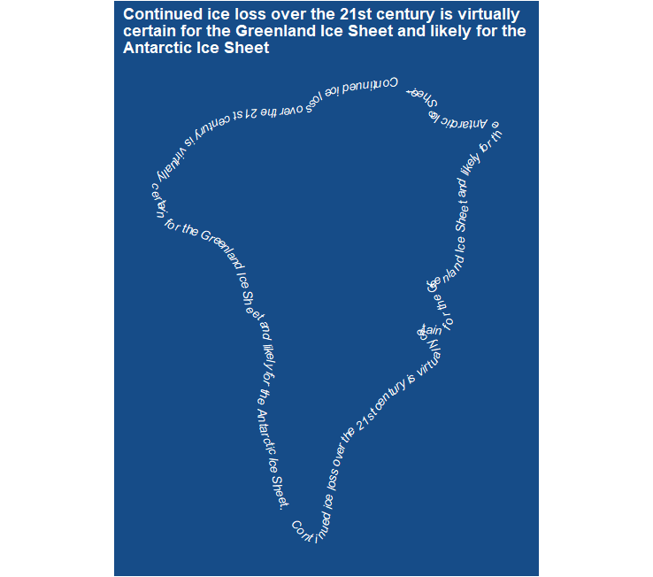

```{r setup, include=FALSE, message=FALSE, warning=FALSE}
knitr::opts_chunk$set(echo = FALSE, message = F, warning = F)
```


```{r, layout='l-body-outset', out.width='120%', fig.width=11.44, fig.height=4.32}
library(tidyverse); library(geomtextpath); library(sf)

virtually_certain <- tibble(
  wave = c('y1', 'y2', 'y3', 'y4', 'y5', 'y6', 'y7', 'y8', 'y9'),
  statement = c("It is virtually certain that the global upper ocean (0–700 m) has warmed since the 1970s and extremely likely that human influence is the main driver.",
                "It is virtually certain that human-caused CO2 emissions are the main driver of current global acidification of the surface open ocean.",
                "It is virtually certain that hot extremes (including heatwaves) have become more frequent and more intense across most land regions since the 1950s, while cold extremes (including cold waves) have become less frequent and less severe, with high confidence that human-induced climate change is the main driver of these changes.",
                "It is virtually certain that the land surface will continue to warm more than the ocean surface (likely 1.4 to 1.7 times more).",
                "It is virtually certain that the Arctic will continue to warm more than global surface temperature, with high confidence above two times the rate of global warming.",
                "Based on multiple lines of evidence, upper ocean stratification (virtually certain), ocean acidification (virtually certain) and ocean deoxygenation (high confidence) will continue to increase in the 21st century, at rates dependent on future emissions.",
                "Continued ice loss over the 21st century is virtually certain for the Greenland Ice Sheet and likely for the Antarctic Ice Sheet.",
                "It is virtually certain that global mean sea level will continue to rise over the 21st century.",
                "It is very likely to virtually certain that regional mean relative sea level rise will continue throughout the 21st century, except in a few regions with substantial geologic land uplift rates.")
) %>%
  mutate(emphasize = wave == 'y8')


x <- seq(0, 16*pi, 0.01)

sine_list <- list()
for (i in 1:nrow(virtually_certain)) {
  sine_list[[i]] <- 0.1*sin(0.3*(x + (i - 1))) - (i - 1)/10
}

names(sine_list) <- virtually_certain$wave

sine_list <- as_tibble(sine_list) %>%
  mutate(x = 1:nrow(.)) %>%
  pivot_longer(-x) %>%
  left_join(virtually_certain, by = c('name' = 'wave'))

sky_df <- data.frame(id = rep(1, 101), sales = seq(0.05, 1.2, (1.2-0.05)/100))

sine_list %>%
  ggplot() +
  geom_textpath(aes(x = x, y = value, group = name, label = statement, color = emphasize), text_only = TRUE, size = 4) +
  geom_tile(data = sky_df, aes(x = 2514, y=sales, fill = sales), width = 5027) +
  scale_y_continuous(expand = c(0, 0), limits = c(-0.9, 1.2)) +
  scale_x_continuous(expand = c(0, 0)) +
  scale_fill_gradient2(low = '#164c88', mid = '#eff5fc', high = '#164c88', midpoint = -0.5) +
  scale_color_manual(values = c('#86a3c4', 'white')) +
  theme(
    panel.background = element_rect(fill = '#164c88'),
    panel.grid = element_blank(),
    legend.position = 'none',
    axis.text = element_blank(),
    axis.title = element_blank(),
    axis.ticks = element_blank()
  )

```


The Intergovernmental Panel on Climate Change (IPCC) releases [assessment reports](https://www.ipcc.ch/report/ar6/wg1/) detailing the current state of climate change and potential remedies that policymakers can enact. I was inspired by the way a [recent QZ article](https://qz.com/2043894/what-does-the-ipcc-say-about-climate-change/) visualized some of the takeaways from the report. The IPCC reports include categories of confidence and certainty on the statements they make: certainty levels range from "more likely than note" (representing > 50% likelihood) to "virtually certain" (99-100% probability).  

This seemed like a good opportunity to try out the new [`geomtextpath` R package](https://github.com/AllanCameron/geomtextpath). I pulled out all statements from the IPCC summary for policymakers that include "virtual certainty" and visualized them in a few ways. These visualizations aren't useful in the way that a readable graph might be, but I think they're pretty and I hope they convey some of the urgency of climate change that is laid out in the IPCC reports.

And I'll note: these aren't cyanotypes, but I recently bought some cyanotype chemicals that I've been playing around with, and I'm really into the deep blue (plus I like alliteration). Enjoy!


```{r}
# gif: Temporal aspect of fireplaces that currently exist

# change_bbox <- function(sf_obj, scalar){
#   bbox_new <- st_bbox(sf_obj) # current bounding box
#   
#   xrange <- bbox_new$xmax - bbox_new$xmin # range of x values
#   yrange <- bbox_new$ymax - bbox_new$ymin # range of y values
#   
#   bbox_new[1] <- bbox_new[1] - (scalar * xrange) # xmin - left
#   bbox_new[3] <- bbox_new[3] + (scalar * xrange) # xmax - right
#   bbox_new[2] <- bbox_new[2] - (scalar * yrange) # ymin - bottom
#   bbox_new[4] <- bbox_new[4] + (scalar * yrange) # ymax - top
#   
#   bbox_new %>%
#     st_as_sfc()
# }
# 
# 
# greenland <- st_read('https://gist.github.com/pnavarrc/fb47d4cab4592e390323#file-greenland-geojson') %>%
#   mutate(ipcc = paste(virtually_certain$statement, collapse = '')) %>%
#   st_cast(to = 'MULTILINESTRING') %>%
#   st_cast(to = 'LINESTRING')
# 
# greenland <- greenland[17,]
# 
# greenland %>%
#   mutate(ipcc = paste("Continued ice loss over the 21st century is virtually certain for the Greenland Ice Sheet and likely for the Antarctic Ice Sheet.",
#                        "Continued ice loss over the 21st century is virtually certain for the Greenland Ice Sheet and likely for the Antarctic Ice Sheet.",
#                        sep = '    ')) %>%
#   ggplot() +
#   geom_textsf(aes(label = ipcc),
#               text_smoothing = 25, linecolour = "#86a3c4",
#               color = "white", fill = "#E6F0B3",
#               fontface = 3, size = 3.6) +
#   labs(title = "Continued ice loss over the 21st century is virtually\ncertain for the Greenland Ice Sheet and likely for the\nAntarctic Ice Sheet") +
#   theme(
#     panel.background = element_rect(fill = '#164c88'),
#     panel.grid = element_blank(),
#     legend.position = 'none',
#     plot.title = element_text(face = 'bold', color = 'white'),
#     plot.background = element_rect(fill = '#164c88'),
#     axis.text = element_blank(),
#     axis.title = element_blank(),
#     axis.ticks = element_blank()
#   )
# # ggsave('greenland.png', width = 6.79, height = 7.69, units = 'in')
# 
# 
# plot_zoomed_out <- function(sf_obj, scalar, text_size){
#   sf_obj %>%
#     mutate(ipcc = paste("Continued ice loss over the 21st century is virtually certain for the Greenland Ice Sheet and likely for the Antarctic Ice Sheet.",
#                         "Continued ice loss over the 21st century is virtually certain for the Greenland Ice Sheet and likely for the Antarctic Ice Sheet.",
#                         sep = '    ')) %>%
#     ggplot() +
#     geom_sf(data = change_bbox(sf_obj, scalar), fill = NA, color = NA) +
#     geom_textsf(aes(label = ipcc),
#                 text_smoothing = 25, linecolour = "#86a3c4",
#                 color = "white", fill = "#E6F0B3",
#                 fontface = 3, size = text_size) +
#     labs(title = "Continued ice loss over the 21st century is virtually\ncertain for the Greenland Ice Sheet and likely for the\nAntarctic Ice Sheet") +
#     theme(
#       panel.background = element_rect(fill = '#164c88'),
#       panel.grid = element_blank(),
#       plot.title = element_text(face = 'bold', color = 'white'),
#       plot.background = element_rect(fill = '#164c88'),
#       legend.position = 'none',
#       axis.text = element_blank(),
#       axis.title = element_blank(),
#       axis.ticks = element_blank()
#     )
#   
#   # ggsave(paste0('greenland', scalar, '.png'), width = 6.79, height = 7.69, units = 'in')
# }
# 
# plot_zoomed_out(greenland, 0.1, 3)
# plot_zoomed_out(greenland, 0.2, 2.58)
# plot_zoomed_out(greenland, 0.3, 2.25)
# plot_zoomed_out(greenland, 0.4, 2)
# plot_zoomed_out(greenland, 0.5, 1.8)
# plot_zoomed_out(greenland, 0.6, 1.65)
# plot_zoomed_out(greenland, 0.7, 1.48)
# plot_zoomed_out(greenland, 0.8, 1.38)
# plot_zoomed_out(greenland, 0.9, 1.28)


```