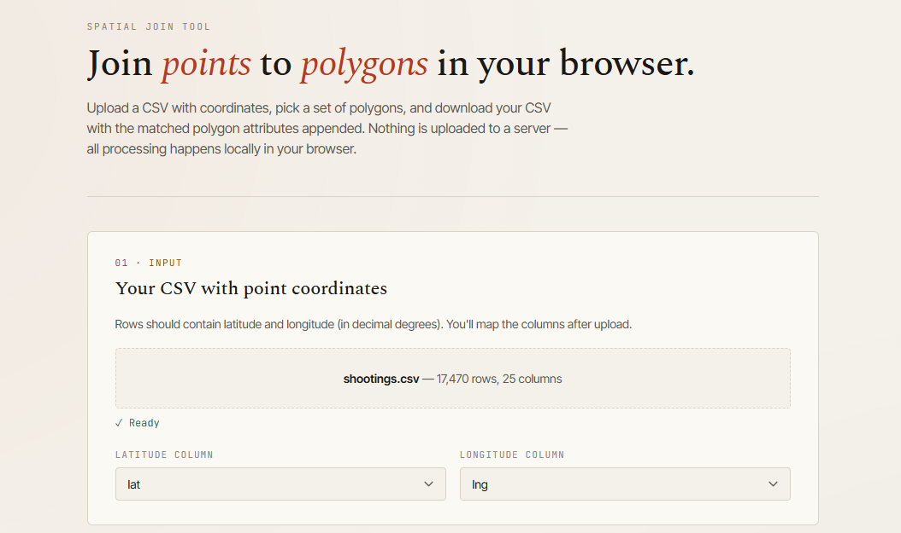
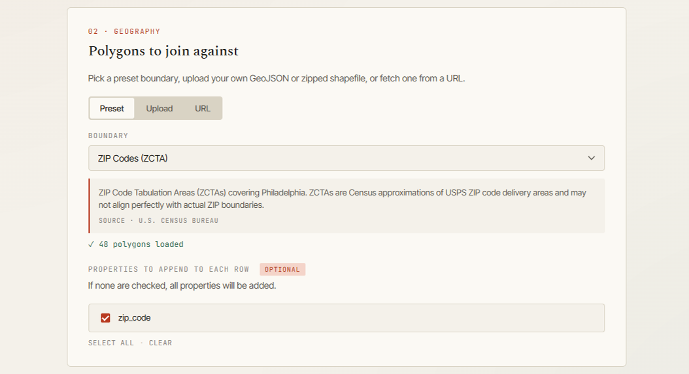
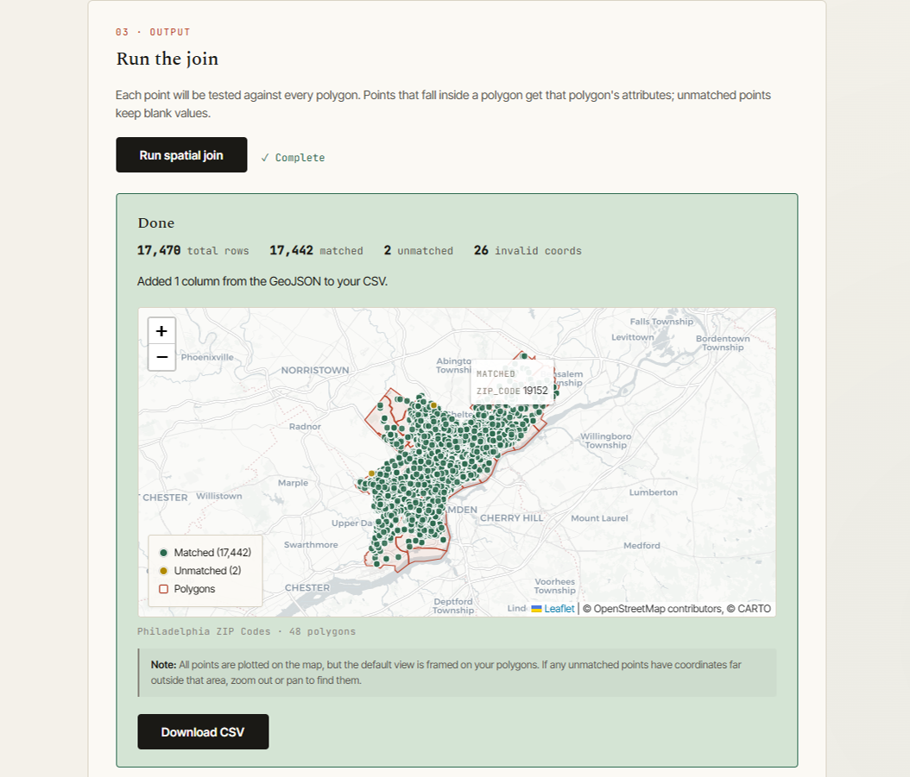

```{r setup, include=FALSE}
knitr::opts_chunk$set(echo = FALSE)
```

I've jumped on the vibecoding train to build a [browser-based tool to perform spatial joins](https://tyler-tran.com/spatialjoin/). This is something that's doable with any GIS software or a couple lines of R or python code, but it won't require any technical setup and won't expose your data to any nefarious actors.

The tool joins point data and polygon data. Let's use an example from OpenDataPhilly: [the public shooting data set](https://opendataphilly.org/datasets/shooting-victims/). This data set has columns for longitude and latitude, but nothing to note which neighborhood, zip code, or City Council district each incident happened in. 

You could use this tool to map and output a CSV with zip code (or neighborhood, or whatever) in just a few clicks. This tool could work for anything with coordinate data: incident locations, real estate, participant location, you name it. And you can choose one of a few preset defaults for your polygons (Philadelphia zip codes, neighborhoods, City Council districts, PA State House and Senate Districts, or US States) or you can upload (or provide the URL to) your own files (in geojson or shapefile format).

Below, I'll walk you through the shooting data to zip code spatial join:

First, you'll upload a CSV with coordinate data (in decimal degree format).

```{r, out.width='100%'}


```

Then, you'll either choose from the preset polygon options or upload your own geojson or shapefile. You can also drop a link if your spatial file is hosted somewhere online (e.g., in a github repo or in an open data portal like OpenDataPhilly). In this example, let's choose the Philly zip code preset.You can choose which of the attributes from the polygon file to join to the point CSV data.

```{r, out.width='100%'}


```

Next, you'll see a map of your points and your polygons. The points on the map are from your CSV -- they'll be colored green if they land within one of the polygons and yellow if they don't. If you hover over the points, you'll see the polygon data joined to the point data.

```{r, out.width='100%'}


```

Last, you can download a new CSV. This'll be the same as the CSV you uploaded except with new columns from the polygon data.

[Check out the tool](https://tyler-tran.com/spatialjoin/).